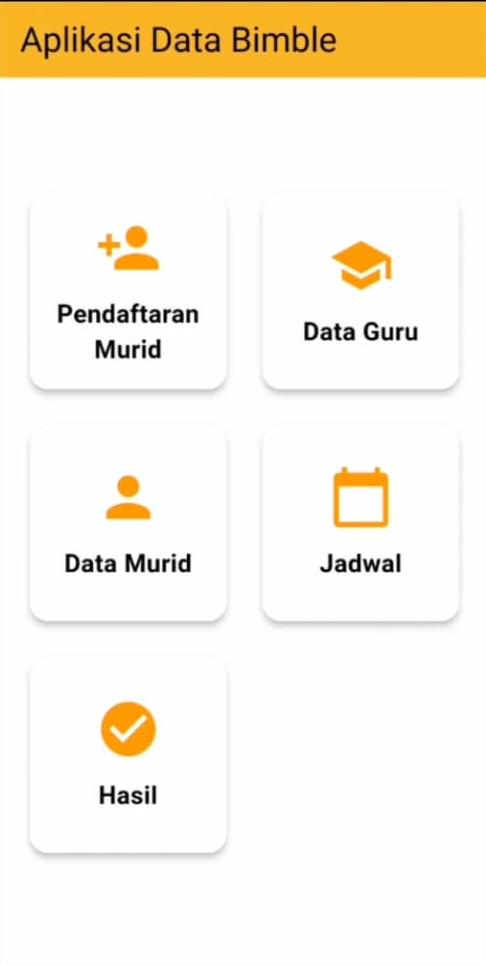
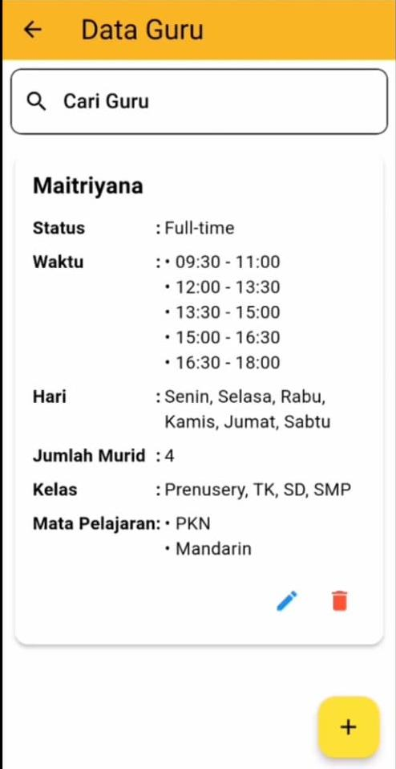
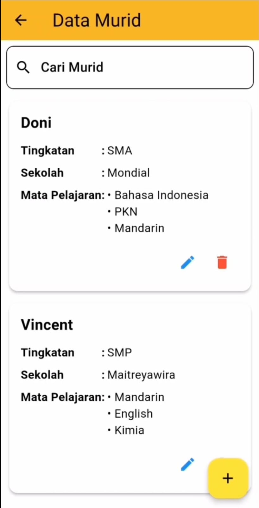
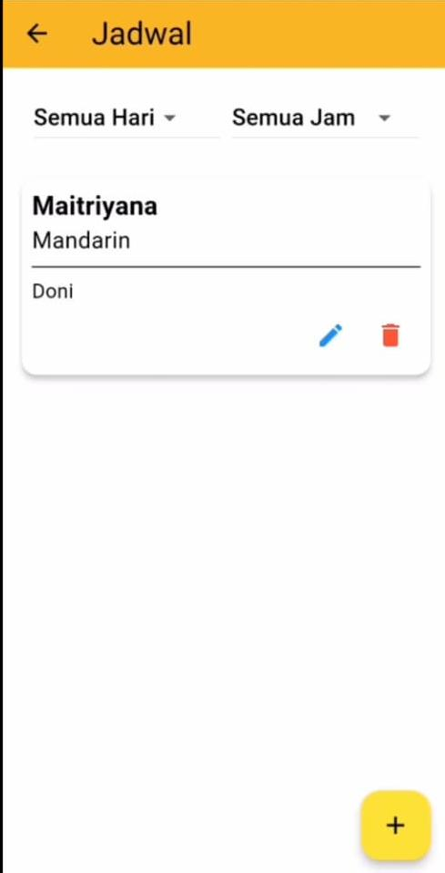
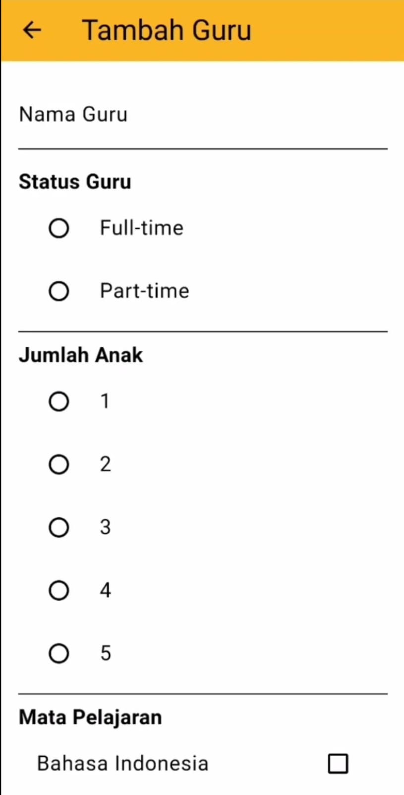
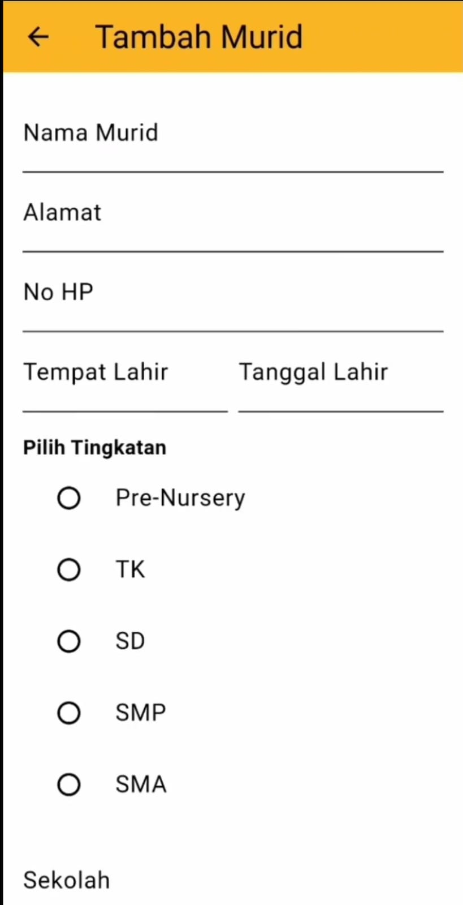
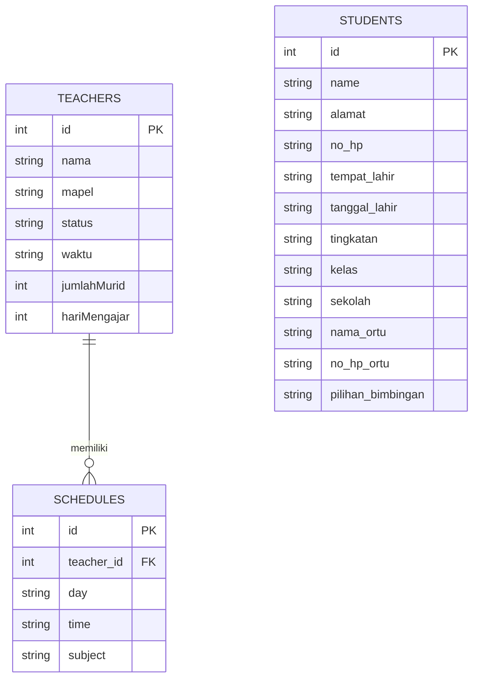

<p align="center">
  
</p>

<h1 align="center">📚 Aplikasi Data Bimble</h1>

<p align="center">
  <strong>Sistem Manajemen Data untuk Lembaga Bimbingan Belajar</strong>
</p>

<p align="center">
  
  
  
  
  
</p>

---

## 📖 Deskripsi

**Aplikasi Data Bimble** adalah aplikasi mobile yang dirancang untuk membantu lembaga bimbingan belajar dalam mengelola data operasional sehari-hari. Aplikasi ini menyediakan fitur lengkap untuk manajemen data **guru**, **murid**, **jadwal pembelajaran**, dan **laporan hasil** bimbingan belajar.

Dibangun menggunakan **Flutter** dengan penyimpanan data lokal menggunakan **SQLite**, aplikasi ini dapat berjalan secara offline tanpa memerlukan koneksi internet.

### ✨ Fitur Utama

| Fitur | Deskripsi |
|-------|-----------|
| 👨‍🏫 **Manajemen Data Guru** | Tambah, edit, dan hapus data guru beserta informasi mata pelajaran, status, waktu mengajar, dan hari mengajar |
| 👨‍🎓 **Manajemen Data Murid** | Pendaftaran murid baru dengan data lengkap (data pribadi, data orang tua, pilihan bimbingan) |
| 📅 **Pengelolaan Jadwal** | Buat dan kelola jadwal pembelajaran dengan filter berdasarkan hari dan waktu |
| 📊 **Tampilan Hasil** | Menampilkan laporan dan hasil kegiatan bimbingan belajar |
| 🔍 **Filter & Pencarian** | Filter jadwal berdasarkan hari (Senin–Minggu) dan slot waktu tertentu |
| 🔄 **Pull-to-Refresh** | Tarik layar ke bawah untuk memperbarui data secara real-time |

---

## 📸 Screenshot

<table>
  <tr>
    <td align="center"><strong>Halaman Utama</strong></td>
    <td align="center"><strong>Data Guru</strong></td>
    <td align="center"><strong>Data Murid</strong></td>
  </tr>
  <tr>
    <td></td>
    <td></td>
    <td></td>
  </tr>
  <tr>
    <td align="center"><strong>Jadwal</strong></td>
    <td align="center"><strong>Tambah Guru</strong></td>
    <td align="center"><strong>Pendaftaran Murid</strong></td>
  </tr>
  <tr>
    <td></td>
    <td></td>
    <td></td>
  </tr>
</table>


---

## 🛠️ Tech Stack

### Framework & Bahasa
| Teknologi | Versi | Keterangan |
|-----------|-------|------------|
| [Flutter](https://flutter.dev/) | 3.x | UI Framework cross-platform |
| [Dart](https://dart.dev/) | ^3.5.1 | Bahasa pemrograman utama |

### Dependencies
| Package | Versi | Fungsi |
|---------|-------|--------|
| [`sqflite`](https://pub.dev/packages/sqflite) | ^2.2.0 | Database SQLite lokal untuk penyimpanan data |
| [`path`](https://pub.dev/packages/path) | ^1.8.0 | Mengelola path file database |
| [`intl`](https://pub.dev/packages/intl) | ^0.17.0 | Format tanggal, waktu, dan lokalisasi |
| [`provider`](https://pub.dev/packages/provider) | ^6.0.0 | State management |
| [`country_code_picker`](https://pub.dev/packages/country_code_picker) | ^2.0.2 | Pemilihan kode negara pada nomor telepon |
| [`logger`](https://pub.dev/packages/logger) | ^2.5.0 | Logging untuk debugging |

### Arsitektur & Pola Desain
- **Repository Pattern** — Pemisahan logika akses data dari UI
- **Singleton Pattern** — Satu instance database yang digunakan di seluruh aplikasi
- **Material Design** — Komponen UI mengikuti standar Material Design Google

---

## 📂 Struktur Project

```
data_guru1/
├── lib/
│   ├── main.dart                  # Entry point aplikasi
│   ├── theme.dart                 # Konfigurasi tema (warna, font, style)
│   ├── database/                  # Database provider & repository (CRUD)
│   ├── enums/                     # Enum untuk rute navigasi
│   ├── models/                    # Model data (Guru, Murid, Jadwal)
│   ├── pages/                     # Halaman-halaman UI
│   │   ├── home_page.dart         # Halaman utama dengan menu navigasi
│   │   ├── data_guru.dart         # Daftar data guru
│   │   ├── data_murid.dart        # Daftar data murid
│   │   ├── daftar_murid.dart      # Form pendaftaran murid baru
│   │   ├── jadwal_page.dart       # Halaman jadwal dengan filter
│   │   ├── hasil_page.dart        # Halaman laporan hasil
│   │   ├── tambah_edit_guru.dart   # Form tambah/edit guru
│   │   ├── tambah_edit_murid.dart  # Form tambah/edit murid
│   │   ├── tambah_jadwal_page.dart # Form tambah jadwal
│   │   ├── edit_guru.dart         # Form edit guru
│   │   ├── edit_murid.dart        # Form edit murid
│   │   ├── edit_jadwal_page.dart   # Form edit jadwal
│   │   └── RincianMuridPage.dart  # Detail informasi murid
│   └── widgets/                   # Widget kustom yang reusable
├── android/                       # Konfigurasi platform Android
├── ios/                           # Konfigurasi platform iOS
├── web/                           # Konfigurasi platform Web
├── screenshots/                   # Screenshot aplikasi untuk dokumentasi
├── pubspec.yaml                   # Konfigurasi project & dependencies
└── README.md                      # Dokumentasi project (file ini)
```

---

## 🚀 Cara Menjalankan Project

### Prasyarat

Pastikan Anda telah menginstal tools berikut:

- **Flutter SDK** (versi 3.x atau lebih baru) — [Panduan Instalasi](https://docs.flutter.dev/get-started/install)
- **Dart SDK** (^3.5.1) — sudah termasuk dalam Flutter SDK
- **Android Studio** atau **VS Code** — sebagai IDE
- **Android Emulator** / **iOS Simulator** / **Perangkat fisik** — untuk menjalankan aplikasi

### Langkah-langkah

1. **Clone repository**
   ```bash
   git clone https://github.com/VincentI123/Aplikasi-Flutter.git
   cd data_guru1
   ```

2. **Install dependencies**
   ```bash
   flutter pub get
   ```

3. **Verifikasi environment** (opsional)
   ```bash
   flutter doctor
   ```
   Pastikan semua checklist ✅ hijau untuk platform target Anda.

4. **Jalankan aplikasi**

   - **Menggunakan Emulator/Simulator:**
     ```bash
     flutter run
     ```

   - **Menggunakan perangkat fisik (USB debugging aktif):**
     ```bash
     flutter run -d <device_id>
     ```
     > Gunakan `flutter devices` untuk melihat daftar perangkat yang terhubung.

   - **Menjalankan di Chrome (Web):**
     ```bash
     flutter run -d chrome
     ```

5. **Build APK** (untuk distribusi Android)
   ```bash
   flutter build apk --release
   ```
   File APK akan tersedia di `build/app/outputs/flutter-apk/app-release.apk`

---

## 🗄️ Database

Aplikasi menggunakan **SQLite** sebagai database lokal dengan 3 tabel utama:



---

## 🤝 Kontribusi

Kontribusi sangat diterima! Silakan ikuti langkah berikut:

1. **Fork** repository ini
2. Buat **branch** fitur baru (`git checkout -b fitur/fitur-baru`)
3. **Commit** perubahan Anda (`git commit -m 'Menambahkan fitur baru'`)
4. **Push** ke branch (`git push origin fitur/fitur-baru`)
5. Buat **Pull Request**

---

## 📄 Lisensi

Project ini dilisensikan di bawah **MIT License** — lihat file [LICENSE](LICENSE) untuk detail.

---

<p align="center">
  Dibuat dengan ❤️ menggunakan <a href="https://flutter.dev">Flutter</a>
</p>
